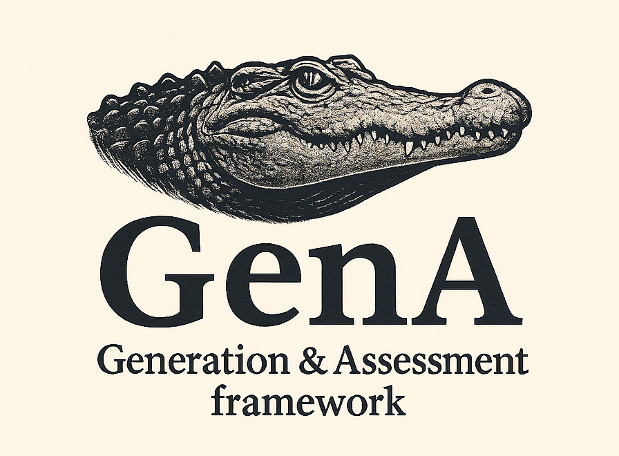

<p align="center">
  
</p>


# GenA — Generation & Assessment Framework

**GenA** is a AI-powered platform designed to assist legal professionals, educators, and researchers in creating high-quality, legally grounded assessment materials. The system automates the generation of exam and training questions—including single-choice, multiple-choice, and open-ended formats—while simultaneously evaluating each question for **provocativeness**, **ambiguity**, and **legal complexity**. This ensures that every output is not only technically sound but also pedagogically effective and ethically balanced.

Built with scalability, transparency, and real-time feedback in mind, GenA enables seamless end-to-end workflows—from document ingestion to validated question banks—making it ideal for legal education, compliance training, and professional certification.


## 🏗️ System Architecture

GenA follows a modular, microservice-based architecture that supports asynchronous processing, real-time monitoring, and robust data management. The system is composed of five core components:

### 1. **gena_web** – Streamlit Web Interface  
The user-facing dashboard for interacting with the entire platform:  
- Upload source documents (PDF, DOCX, TXT)  
- Configure and launch question-generation jobs  
- Monitor dataset progress in real time  
- Manage queues and review generated questions  

### 2. **chunker** – Semantic Document Chunking Service  
Preprocesses legal texts into meaningful, context-aware segments:  
- Powered by the `multilingual-e5-large` embedding model  
- Preserves legal context and document structure  
- Exposes a REST API at `/chunk/`  

### 3. **agent_api** – Intelligent Question Generation Engine  
The AI core of GenA, built on LangGraph for stateful, multi-step reasoning:  
- Generates legally coherent questions using LLMs  
- Evaluates each question across three dimensions: provocation, ambiguity, and complexity  
- Performs quality validation before output  
- Accessible via `/process_prompt/`  

### 4. **dataset_api** – Central Data & Queue Orchestrator  
Manages all persistent data and task coordination:  
- Full CRUD operations for datasets and versions  
- Task queue lifecycle management  
- Real-time progress tracking and status updates  
- REST endpoints: `/datasets/`, `/queues/`, `/tasks/`  

### 5. **task_worker** – Background Task Processor  
Asynchronously executes generation pipelines:  
- Polls task queues for new work  
- Delegates to `agent_api` for question generation  
- Saves results **incrementally** to datasets as they are produced  
- Tracks per-dataset progress and handles failures gracefully  

---
---
## 📚 How to Use GenA

GenA’s advantage is its user-friendly web interface—no command-line expertise required. GenA provides immediate access to results, real-time progress tracking, and interactive reports directly in your browser.

Follow these steps to generate and evaluate legal assessment questions:
### 1. Access the Web Interface  
Open your browser and go to:  
**http://localhost:27369**

> 💡 For testing, you can use the sample legal document provided directly in the web interface—no upload required.

### 2. Upload a Document  
Click the **"Upload a document"** button and select a `.docx`, `.txt`, or `.pdf` file from your computer.

### 3. Wait for Processing  
The system will automatically split your document into logical, semantically meaningful chunks.  
You’ll see a confirmation message once chunking is complete.

### 4. Select Question Types  
Choose one or more question formats:  
- **one** – Single correct answer  
- **multi** – Multiple correct answers  
- **open** – Open-ended question  

> If no types are selected, GenA will generate **all three types** by default.

### 5. Generate Questions  
Click the **"Generate Questions"** button.  
The system will create one question per selected type for **each document chunk** and process them in the background.

### 6. View Results in Real Time  
As questions are generated, they appear in the interface. For each question, you’ll see:  
- **Source text** (click to expand)  
- **Task prompt**  
- **Numbered list of answer options** (for MCQs)  
- **Correct Answer**  
- **Provocativeness Score** (0–1 scale)  
- **Validation Score** (overall quality assessment)  
- **Detailed validation breakdown** (click to expand for metrics on ambiguity, complexity, etc.)

### 7. Confirm Question Suitability  
After reviewing, click the **"Confirm"** button to validate the sensitivity and appropriateness of each question’s provocativeness level. This step finalizes the dataset.

### 8. Export Results  
Once satisfied, click the **📥 Download as CSV** button to export all generated questions, scores, and metadata into a spreadsheet for further use or integration.

## 🚀 Getting Started

### Run with Docker Compose

```bash
# 1. Configure environment
cp env.example .env
nano .env  # adjust as needed

# 2. Launch all services
docker-compose up -d

# 3. Verify
docker-compose ps
```

**Access points:**  
- 🌐 Web UI: http://localhost:27369  
- 🧩 Chunker API: http://localhost:8517  
- 🤖 Agent API: http://localhost:8790  
- 🗃️ Dataset API: http://localhost:8789  


## 🔧 Configuration
GenA is configured via environment variables defined in a .env file. Below is a reference based on the current system setup:

### Core Services
```bash
# MongoDB
MONGO_USERNAME=
MONGO_PASSWORD=
MONGO_HOST=
MONGO_PORT=
MONGO_DB_NAME=
MAX_MESSAGES_HISTORY=

# Milvus (for vector storage, if used)
MILVUS_HOST=
MILVUS_PORT=
```

### Language Models & Embeddings
```bash
# LLM Configuration
LLM_MODEL_NAME=
LLM_URL_MODEL=
LLM_API_KEY=
MAX_LEN_USER_PROMPT=

# Embedding Model (Text Embeddings Inference)
TEI_MODEL_NAME=
TEI_URL_EMBEDDER=
TEI_API_KEY=
```
### Internal API Endpoints
```bash
API_GEN_QUE_URL=http://agent-api:8790/process_prompt/
API_DATASET_URL=http://dataset-api:8789
API_CHANKS_URL=  # e.g., http://gena-chunker:8517/chunk/
```
### File & Runtime Settings
```bash
CHUNKS_DIR=./chunks
MODEL_NAME=  # optional override
```

### Docker Network & Container Names
```bash
GENA_NET=gena_net

AGENT_API_CONTAINER_NAME=agent-api
GENA_WEB_CONTAINER_NAME=gena_web
DATASET_API_CONTAINER_NAME=dataset-api
TASK_WORKER_CONTAINER_NAME=task_worker
GENA_CHUNKER_CONTAINER_NAME=gena-chunker
RUADAPT_QWEN_SERVER_CONTAINER_NAME=quadapt_qwen_server
```